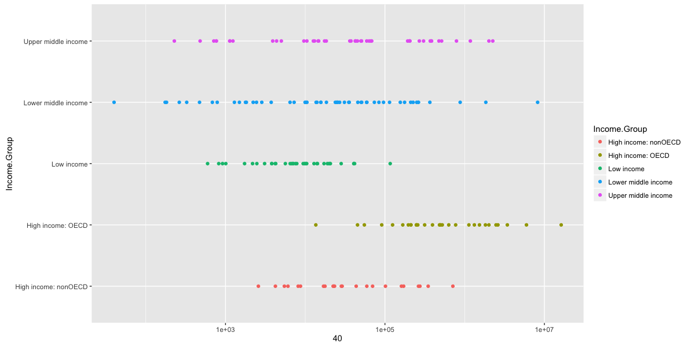

# World Bank Data Analysis
Rick Coleman  
10/25/2016  

## Gross Domestic Product Analysis {.tabset .tabset-fade .tabset-pills}

### Introduction

We would like to analyze Gross Domestic Product for all countries, we have two datasets,[Gross Domestic Product](http://data.worldbank.org/data-catalog/GDP-ranking-table) and [Educational](http://data.worldbank.org/data-catalog/ed-stats). To conduct our analysis, tidy data is required, therefore, we will conduct multiple steps to clean, merge and sort the data.
Data was obtained from the [World Bank](http://www.worldbank.org) website and includes list of countries and numerous features for every country. As for this analysis, we are only interested few features and we'll eliminate the other ones to save space.
All the work is split into multiple files by function and the files are  
  
`Libraries.R`     contains all libraries necessary for this analysis  
`DataLoad.R`      contains all the steps necessary to gather the data, load it and clean it  
`MergeandSort.R`  contains merging and sorting steps necessary to answer the questions  
`Analyze.R`       contains all the answers to the different questions asked  

### Libraries
Loading all necessary libraries to be utilized in our analysis

```r
library(bitops)
library(plyr)
library(ggplot2)
library(downloader)
library(RCurl)
library(repmis)
library(xtable)
```

### Data Load

**Download Files from the internet**


```r
#Set Working Directory
setwd("/Users/NRC/DataScience-SMU/CaseStudy1")
# Importing Files from the web
GDPsite <- "https://d396qusza40orc.cloudfront.net/getdata%2Fdata%2FGDP.csv"
EDUCsite <- "https://d396qusza40orc.cloudfront.net/getdata%2Fdata%2FEDSTATS_Country.csv"
download.file(GDPsite,destfile = "Data/GDP.csv")
download.file(EDUCsite,destfile = "Data/EDUC.csv")
```
Both files are downloaded into the data folder

**Read CSV files downloaded in the data folder**


```r
# Loading GDP Data and load only the lines that correspond with a ranked country
# We are also changing the column labels and removing unwanted columns
GDP <- read.csv ("Data/GDP.csv",sep = ",",header = FALSE, skip=5,nrows = 190,col.names = c("CountryCode","Ranking","Blank","CounterName","CountryGDP","V6","V7","V8","V9","V10"))
GDP[6:10] <- NULL
GDP[3] <- NULL

# Loading Education Data and Loading only fields required by our analysis
Educ <- read.csv("Data/EDUC.csv",sep = ",",header = TRUE)
Educ <- Educ[c(1,3)]
```


```r
# Changing the format of our CountryGDP and Ranking to be able to sort them later
GDP$CountryGDP <- as.numeric(gsub("[^[:digit:]]","", GDP$CountryGDP))
GDP$Ranking <- as.numeric(gsub("[^[:digit:]]","", GDP$Ranking))
```
### Merge and Sort

```r
# Merging Data sets by short country code
GDPandEDUC <- merge(Educ, GDP, by = "CountryCode")

# Sorting data in Ascending order by dollars
GDPandEDUCSorted <- GDPandEDUC[order(GDPandEDUC$CountryGDP, decreasing = FALSE),]
```


### Analysis #1 #2 #3

#### 1- How many of the IDs match?

```r
# Printing the number of Country Code that matches between the two datasets
print(paste0("ID's in both tables: ",length(intersect(GDP$CountryCode,Educ$CountryCode))))
```

[1] "ID's in both tables: 189"
There are 189 ID that match between both datasets

#### 2- What is the 13th country in the resulting data frame?


```r
# Extracting the 13 row from the data to check the 13 country ranking
X <- GDPandEDUCSorted[13,]
knitr::kable(X,padding = 2,align = 'l',format = "html")
```

<table>
 <thead>
  <tr>
   <th style="text-align:left;">   </th>
   <th style="text-align:left;"> CountryCode </th>
   <th style="text-align:left;"> Income.Group </th>
   <th style="text-align:left;"> Ranking </th>
   <th style="text-align:left;"> CounterName </th>
   <th style="text-align:left;"> CountryGDP </th>
  </tr>
 </thead>
<tbody>
  <tr>
   <td style="text-align:left;"> 93 </td>
   <td style="text-align:left;"> KNA </td>
   <td style="text-align:left;"> Upper middle income </td>
   <td style="text-align:left;"> 178 </td>
   <td style="text-align:left;"> St. Kitts and Nevis </td>
   <td style="text-align:left;"> 767 </td>
  </tr>
</tbody>
</table>

The 13 Country in the dataset is St. Kitts and Nevis

#### 3- What are the average GDP rankings for the "High income: OECD" and "High income:nonOECD" groups?


```r
# Showing two income groups and there average ranking. Using kable from knitr to show the table in nice form
Y <- ddply(GDPandEDUCSorted[GDPandEDUCSorted$Income.Group == "High income: nonOECD" | GDPandEDUCSorted$Income.Group == "High income: OECD",],.(Income.Group),summarize, "Average Ranking"=mean(Ranking))
knitr::kable(Y,padding = 2, align = 'l',format = "html")
```

<table>
 <thead>
  <tr>
   <th style="text-align:left;"> Income.Group </th>
   <th style="text-align:left;"> Average Ranking </th>
  </tr>
 </thead>
<tbody>
  <tr>
   <td style="text-align:left;"> High income: nonOECD </td>
   <td style="text-align:left;"> 91.91304 </td>
  </tr>
  <tr>
   <td style="text-align:left;"> High income: OECD </td>
   <td style="text-align:left;"> 32.96667 </td>
  </tr>
</tbody>
</table>

* Average Ranking for High Income nonOECD Countries:  91.91
* Average Ranking for High Income OECD Countries:     32.96

### Analysis #4
#### Plot the GDP for all of the countries. Use ggplot2 to color your plot by Income Group
##### Creating a scatter plot with all countries, grouped by Income Group

```r
# Plotting a scatter plot to showcase countries by Income Group and their GDP
W <- ggplot(GDPandEDUCSorted)+ geom_point(aes(x=CountryGDP,y=Income.Group,colour=Income.Group))+scale_x_log10()+labs(x = GDPandEDUCSorted$CountryGDP)
```

GDP of Countries by Income Group:


### Analysis #5
#### Cut the GDP ranking into 5 separate quantile groups. Make a table versus Income.Group. How many countries are Lower middle income but among the 38 nations with highest GDP?

```r
# Changing the Ranking column to numeric
GDPandEDUCSorted$Ranking <- as.numeric(as.character(GDPandEDUCSorted$Ranking))
# Cutting the GDP Ranking into 5 separate quantile groups
GDPandEDUCSorted$Quants <- cut(GDPandEDUCSorted$Ranking,breaks = 5)
# Creating a table 
GDPQuants <- table(GDPandEDUCSorted$Income.Group,GDPandEDUCSorted$Quants)
knitr::kable(GDPQuants,padding = 5, align  = 'l',format = "html")
```

<table>
 <thead>
  <tr>
   <th style="text-align:left;">   </th>
   <th style="text-align:left;"> (0.811,38.8] </th>
   <th style="text-align:left;"> (38.8,76.6] </th>
   <th style="text-align:left;"> (76.6,114] </th>
   <th style="text-align:left;"> (114,152] </th>
   <th style="text-align:left;"> (152,190] </th>
  </tr>
 </thead>
<tbody>
  <tr>
   <td style="text-align:left;">  </td>
   <td style="text-align:left;"> 0 </td>
   <td style="text-align:left;"> 0 </td>
   <td style="text-align:left;"> 0 </td>
   <td style="text-align:left;"> 0 </td>
   <td style="text-align:left;"> 0 </td>
  </tr>
  <tr>
   <td style="text-align:left;"> High income: nonOECD </td>
   <td style="text-align:left;"> 4 </td>
   <td style="text-align:left;"> 5 </td>
   <td style="text-align:left;"> 8 </td>
   <td style="text-align:left;"> 4 </td>
   <td style="text-align:left;"> 2 </td>
  </tr>
  <tr>
   <td style="text-align:left;"> High income: OECD </td>
   <td style="text-align:left;"> 18 </td>
   <td style="text-align:left;"> 10 </td>
   <td style="text-align:left;"> 1 </td>
   <td style="text-align:left;"> 1 </td>
   <td style="text-align:left;"> 0 </td>
  </tr>
  <tr>
   <td style="text-align:left;"> Low income </td>
   <td style="text-align:left;"> 0 </td>
   <td style="text-align:left;"> 1 </td>
   <td style="text-align:left;"> 9 </td>
   <td style="text-align:left;"> 16 </td>
   <td style="text-align:left;"> 11 </td>
  </tr>
  <tr>
   <td style="text-align:left;"> Lower middle income </td>
   <td style="text-align:left;"> 5 </td>
   <td style="text-align:left;"> 13 </td>
   <td style="text-align:left;"> 12 </td>
   <td style="text-align:left;"> 8 </td>
   <td style="text-align:left;"> 16 </td>
  </tr>
  <tr>
   <td style="text-align:left;"> Upper middle income </td>
   <td style="text-align:left;"> 11 </td>
   <td style="text-align:left;"> 9 </td>
   <td style="text-align:left;"> 8 </td>
   <td style="text-align:left;"> 8 </td>
   <td style="text-align:left;"> 9 </td>
  </tr>
</tbody>
</table>

```r
# Create a table that shows the countries with Lower middle income but among the 38 nations with highest GDP
Z <- GDPandEDUCSorted[which(GDPandEDUCSorted$Ranking <= 38 & GDPandEDUCSorted$Income.Group == "Lower middle income"),]
knitr::kable(Z, padding = 2, align = 'l',format = "html")
```

<table>
 <thead>
  <tr>
   <th style="text-align:left;">   </th>
   <th style="text-align:left;"> CountryCode </th>
   <th style="text-align:left;"> Income.Group </th>
   <th style="text-align:left;"> Ranking </th>
   <th style="text-align:left;"> CounterName </th>
   <th style="text-align:left;"> CountryGDP </th>
   <th style="text-align:left;"> Quants </th>
  </tr>
 </thead>
<tbody>
  <tr>
   <td style="text-align:left;"> 51 </td>
   <td style="text-align:left;"> EGY </td>
   <td style="text-align:left;"> Lower middle income </td>
   <td style="text-align:left;"> 38 </td>
   <td style="text-align:left;"> Egypt, Arab Rep. </td>
   <td style="text-align:left;"> 262832 </td>
   <td style="text-align:left;"> (0.811,38.8] </td>
  </tr>
  <tr>
   <td style="text-align:left;"> 165 </td>
   <td style="text-align:left;"> THA </td>
   <td style="text-align:left;"> Lower middle income </td>
   <td style="text-align:left;"> 31 </td>
   <td style="text-align:left;"> Thailand </td>
   <td style="text-align:left;"> 365966 </td>
   <td style="text-align:left;"> (0.811,38.8] </td>
  </tr>
  <tr>
   <td style="text-align:left;"> 77 </td>
   <td style="text-align:left;"> IDN </td>
   <td style="text-align:left;"> Lower middle income </td>
   <td style="text-align:left;"> 16 </td>
   <td style="text-align:left;"> Indonesia </td>
   <td style="text-align:left;"> 878043 </td>
   <td style="text-align:left;"> (0.811,38.8] </td>
  </tr>
  <tr>
   <td style="text-align:left;"> 78 </td>
   <td style="text-align:left;"> IND </td>
   <td style="text-align:left;"> Lower middle income </td>
   <td style="text-align:left;"> 10 </td>
   <td style="text-align:left;"> India </td>
   <td style="text-align:left;"> 1841710 </td>
   <td style="text-align:left;"> (0.811,38.8] </td>
  </tr>
  <tr>
   <td style="text-align:left;"> 34 </td>
   <td style="text-align:left;"> CHN </td>
   <td style="text-align:left;"> Lower middle income </td>
   <td style="text-align:left;"> 2 </td>
   <td style="text-align:left;"> China </td>
   <td style="text-align:left;"> 8227103 </td>
   <td style="text-align:left;"> (0.811,38.8] </td>
  </tr>
</tbody>
</table>

We found 5 countries that matches our criteria above
